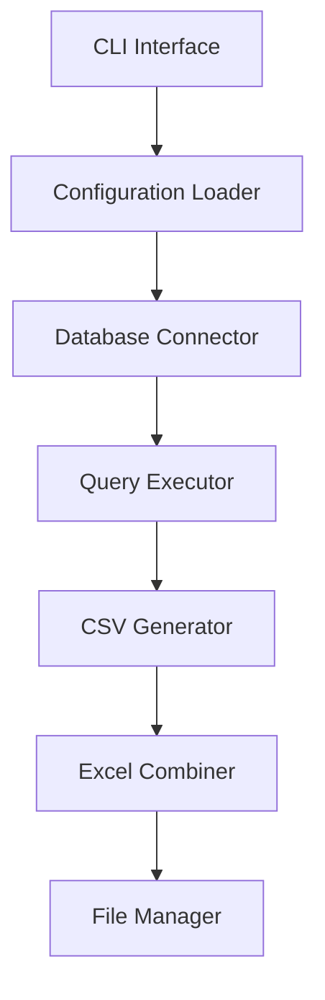

# System Patterns: Volume Reporting System

## Architecture
- Command-line interface using Typer
- Modular design with separate functions for:
  - Database connection management
  - Query execution
  - File generation
  - Excel formatting

## Design Patterns
1. **Configuration Management**
   - JSON-based configuration for database connections
   - External SQL query file for easy updates
   - Environment-agnostic design

2. **Error Handling**
   - Graceful error handling for database connections
   - Continue-on-error pattern for multi-database processing
   - Clear error messaging

3. **File Management**
   - Date-based file naming (YYYYMMDD)
   - Separate CSV files for each client
   - Consolidated Excel output
   - Auto-sized columns for readability

4. **Database Access**
   - SQLAlchemy for database connectivity
   - Connection pooling
   - Secure credential management

## Component Relationships

## Key Technical Decisions
- To be documented as decisions are made

## Data Flow
- To be defined based on project needs

## Security Patterns
- To be defined based on project needs 